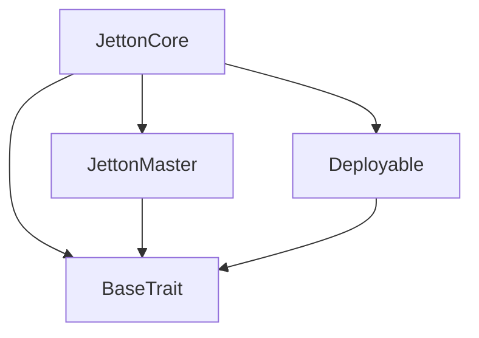
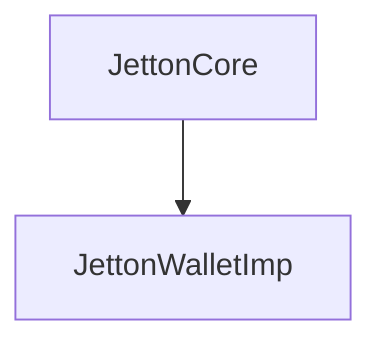

# TACT Compilation Report
Contract: JettonCore
BOC Size: 3184 bytes

# Types
Total Types: 38

## StateInit
TLB: `_ code:^cell data:^cell = StateInit`
Signature: `StateInit{code:^cell,data:^cell}`

## StdAddress
TLB: `_ workchain:int8 address:uint256 = StdAddress`
Signature: `StdAddress{workchain:int8,address:uint256}`

## VarAddress
TLB: `_ workchain:int32 address:^slice = VarAddress`
Signature: `VarAddress{workchain:int32,address:^slice}`

## Context
TLB: `_ bounced:bool sender:address value:int257 raw:^slice = Context`
Signature: `Context{bounced:bool,sender:address,value:int257,raw:^slice}`

## SendParameters
TLB: `_ bounce:bool to:address value:int257 mode:int257 body:Maybe ^cell code:Maybe ^cell data:Maybe ^cell = SendParameters`
Signature: `SendParameters{bounce:bool,to:address,value:int257,mode:int257,body:Maybe ^cell,code:Maybe ^cell,data:Maybe ^cell}`

## Deploy
TLB: `deploy#946a98b6 queryId:uint64 = Deploy`
Signature: `Deploy{queryId:uint64}`

## DeployOk
TLB: `deploy_ok#aff90f57 queryId:uint64 = DeployOk`
Signature: `DeployOk{queryId:uint64}`

## FactoryDeploy
TLB: `factory_deploy#6d0ff13b queryId:uint64 cashback:address = FactoryDeploy`
Signature: `FactoryDeploy{queryId:uint64,cashback:address}`

## ChangeOwner
TLB: `change_owner#819dbe99 queryId:uint64 newOwner:address = ChangeOwner`
Signature: `ChangeOwner{queryId:uint64,newOwner:address}`

## ChangeOwnerOk
TLB: `change_owner_ok#327b2b4a queryId:uint64 newOwner:address = ChangeOwnerOk`
Signature: `ChangeOwnerOk{queryId:uint64,newOwner:address}`

## RegisterToken
TLB: `register_token#17876e7c tokenAddress:address = RegisterToken`
Signature: `RegisterToken{tokenAddress:address}`

## VerifyJetton
TLB: `verify_jetton#418a7ffc queryId:uint64 tokenAddress:address = VerifyJetton`
Signature: `VerifyJetton{queryId:uint64,tokenAddress:address}`

## JettonVerified
TLB: `jetton_verified#4e0d916b queryId:uint64 isJetton:bool tokenAddress:address = JettonVerified`
Signature: `JettonVerified{queryId:uint64,isJetton:bool,tokenAddress:address}`

## BuyTokens
TLB: `buy_tokens#30e5b29f resAddress:address tonAmount:int257 = BuyTokens`
Signature: `BuyTokens{resAddress:address,tonAmount:int257}`

## SellTokens
TLB: `sell_tokens#975489d8 resAddress:address tokenAmount:int257 = SellTokens`
Signature: `SellTokens{resAddress:address,tokenAmount:int257}`

## PoolBuy
TLB: `pool_buy#323f9a04 jettonAddress:address = PoolBuy`
Signature: `PoolBuy{jettonAddress:address}`

## PoolSell
TLB: `pool_sell#79a1872f jettonAddress:address to:address amount:coins = PoolSell`
Signature: `PoolSell{jettonAddress:address,to:address,amount:coins}`

## AddJetton
TLB: `add_jetton#6cbf9e55 jettonAddress:address = AddJetton`
Signature: `AddJetton{jettonAddress:address}`

## BuyMint
TLB: `buy_mint#d831cdcd tokenAmount:int257 = BuyMint`
Signature: `BuyMint{tokenAmount:int257}`

## BurnNotificationWithTon
TLB: `burn_notification_with_ton#0b85df36 amount:coins tokenAmount:coins user:address = BurnNotificationWithTon`
Signature: `BurnNotificationWithTon{amount:coins,tokenAmount:coins,user:address}`

## WithdrawFromPool
TLB: `withdraw_from_pool#e33b0a47 jettonAddress:address amount:coins = WithdrawFromPool`
Signature: `WithdrawFromPool{jettonAddress:address,amount:coins}`

## TransferOwnership
TLB: `transfer_ownership#70373fea newOwner:address = TransferOwnership`
Signature: `TransferOwnership{newOwner:address}`

## JettonCore$Data
TLB: `null`
Signature: `null`

## JettonWalletImp$Data
TLB: `null`
Signature: `null`

## JettonMint
TLB: `jetton_mint#89b71d09 origin:address receiver:address amount:int257 custom_payload:Maybe ^cell forward_ton_amount:coins forward_payload:remainder<slice> = JettonMint`
Signature: `JettonMint{origin:address,receiver:address,amount:int257,custom_payload:Maybe ^cell,forward_ton_amount:coins,forward_payload:remainder<slice>}`

## JettonData
TLB: `_ total_supply:int257 mintable:bool admin_address:address jetton_content:^cell jetton_wallet_code:^cell = JettonData`
Signature: `JettonData{total_supply:int257,mintable:bool,admin_address:address,jetton_content:^cell,jetton_wallet_code:^cell}`

## JettonTransfer
TLB: `jetton_transfer#0f8a7ea5 query_id:uint64 amount:coins destination:address response_destination:address custom_payload:Maybe ^cell forward_ton_amount:coins forward_payload:remainder<slice> = JettonTransfer`
Signature: `JettonTransfer{query_id:uint64,amount:coins,destination:address,response_destination:address,custom_payload:Maybe ^cell,forward_ton_amount:coins,forward_payload:remainder<slice>}`

## JettonTransferNotification
TLB: `jetton_transfer_notification#7362d09c query_id:uint64 amount:coins sender:address forward_payload:remainder<slice> = JettonTransferNotification`
Signature: `JettonTransferNotification{query_id:uint64,amount:coins,sender:address,forward_payload:remainder<slice>}`

## JettonBurn
TLB: `jetton_burn#595f07bc query_id:uint64 amount:coins response_destination:address custom_payload:Maybe ^cell = JettonBurn`
Signature: `JettonBurn{query_id:uint64,amount:coins,response_destination:address,custom_payload:Maybe ^cell}`

## JettonExcesses
TLB: `jetton_excesses#d53276db query_id:uint64 = JettonExcesses`
Signature: `JettonExcesses{query_id:uint64}`

## JettonInternalTransfer
TLB: `jetton_internal_transfer#178d4519 query_id:uint64 amount:coins from:address response_address:Maybe address forward_ton_amount:coins forward_payload:remainder<slice> = JettonInternalTransfer`
Signature: `JettonInternalTransfer{query_id:uint64,amount:coins,from:address,response_address:Maybe address,forward_ton_amount:coins,forward_payload:remainder<slice>}`

## JettonBurnNotification
TLB: `jetton_burn_notification#7bdd97de query_id:uint64 amount:coins sender:address response_destination:address = JettonBurnNotification`
Signature: `JettonBurnNotification{query_id:uint64,amount:coins,sender:address,response_destination:address}`

## WalletData
TLB: `_ balance:coins owner:address jetton:address jetton_wallet_code:^cell = WalletData`
Signature: `WalletData{balance:coins,owner:address,jetton:address,jetton_wallet_code:^cell}`

## JettonPool
TLB: `_ balance:coins isActive:bool = JettonPool`
Signature: `JettonPool{balance:coins,isActive:bool}`

## PendingSell
TLB: `_ jettonAddress:address sender:address amount:int257 = PendingSell`
Signature: `PendingSell{jettonAddress:address,sender:address,amount:int257}`

## WalletDataMessage
TLB: `wallet_data_message#f2d6cb28 balance:int257 owner:address jetton:address jetton_wallet_code:^cell = WalletDataMessage`
Signature: `WalletDataMessage{balance:int257,owner:address,jetton:address,jetton_wallet_code:^cell}`

## DeployJetton
TLB: `deploy_jetton#5e49412b owner:address content:^cell max_supply:int257 token_price:int257 initial_mint:int257 pool:address = DeployJetton`
Signature: `DeployJetton{owner:address,content:^cell,max_supply:int257,token_price:int257,initial_mint:int257,pool:address}`

## PoolCore$Data
TLB: `null`
Signature: `null`

# Get Methods
Total Get Methods: 7

## getPriceForAmount
Argument: purchase_amount

## getTotalCostForAmount
Argument: purchase_amount

## getCurrentPrice

## getCurrentPrice2

## getTotalSupplyInCoins

## get_jetton_data

## get_wallet_address
Argument: owner_address

# Error Codes
2: Stack underflow
3: Stack overflow
4: Integer overflow
5: Integer out of expected range
6: Invalid opcode
7: Type check error
8: Cell overflow
9: Cell underflow
10: Dictionary error
11: 'Unknown' error
12: Fatal error
13: Out of gas error
14: Virtualization error
32: Action list is invalid
33: Action list is too long
34: Action is invalid or not supported
35: Invalid source address in outbound message
36: Invalid destination address in outbound message
37: Not enough TON
38: Not enough extra-currencies
39: Outbound message does not fit into a cell after rewriting
40: Cannot process a message
41: Library reference is null
42: Library change action error
43: Exceeded maximum number of cells in the library or the maximum depth of the Merkle tree
50: Account state size exceeded limits
128: Null reference exception
129: Invalid serialization prefix
130: Invalid incoming message
131: Constraints error
132: Access denied
133: Contract stopped
134: Invalid argument
135: Code of a contract was not found
136: Invalid address
137: Masterchain support is not enabled for this contract
2296: JettonWallet: Only Jetton master or Jetton wallet can call this function
5530: Jetton already exists
9739: Sender is not a Jetton wallet
9899: No pending sell request
13105: JettonWallet: Not enough jettons to transfer
13824: Insufficient tokens to burn
14796: Exceeds max supply
15093: Pool for this jetton does not exist
15703: Insufficient Jetton balance
21185: Insufficient gas for withdrawal
24734: Invalid wallet address
26288: Minting is disabled
26825: Only owner can withdraw
27544: Invalid mint amount
29133: JettonWallet: Not allow negative balance after internal transfer
29951: Purchase amount must be greater than 0
30061: JettonMaster: Jetton is not mintable
31558: Invalid token price
35850: Pool must be empty to remove
37185: Not enough funds to transfer
40476: Amount must be greater than 0
42120: Pool does not exist
42931: Not authorized to transfer ownership
43365: JettonMaster: Sender is not a Jetton owner
45732: Only owner can add jettons
47483: Insufficient value sent for deployment
50816: Max supply must be greater than 0
54531: Invalid initial mint amount
54615: Insufficient balance
57579: Only owner can mint
57646: Amount too small to mint tokens
57964: Insufficient pool balance
58172: Only owner can remove pools
58297: Purchase would exceed max supply
58582: JettonWallet: Only owner can call this function
58866: Token price must be greater than 0
60354: JettonWallet: Not enough balance to burn tokens
61350: Invalid sender: must be pool or valid wallet
62441: Insufficient value sent
63779: Would exceed max supply

# Trait Inheritance Diagram

# Contract Dependency Diagram

