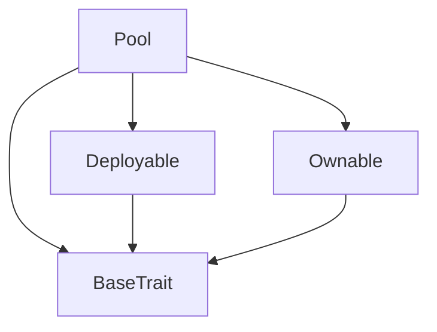
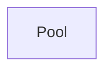

# TACT Compilation Report
Contract: Pool
BOC Size: 1269 bytes

# Types
Total Types: 20

## StateInit
TLB: `_ code:^cell data:^cell = StateInit`
Signature: `StateInit{code:^cell,data:^cell}`

## StdAddress
TLB: `_ workchain:int8 address:uint256 = StdAddress`
Signature: `StdAddress{workchain:int8,address:uint256}`

## VarAddress
TLB: `_ workchain:int32 address:^slice = VarAddress`
Signature: `VarAddress{workchain:int32,address:^slice}`

## Context
TLB: `_ bounced:bool sender:address value:int257 raw:^slice = Context`
Signature: `Context{bounced:bool,sender:address,value:int257,raw:^slice}`

## SendParameters
TLB: `_ bounce:bool to:address value:int257 mode:int257 body:Maybe ^cell code:Maybe ^cell data:Maybe ^cell = SendParameters`
Signature: `SendParameters{bounce:bool,to:address,value:int257,mode:int257,body:Maybe ^cell,code:Maybe ^cell,data:Maybe ^cell}`

## Deploy
TLB: `deploy#946a98b6 queryId:uint64 = Deploy`
Signature: `Deploy{queryId:uint64}`

## DeployOk
TLB: `deploy_ok#aff90f57 queryId:uint64 = DeployOk`
Signature: `DeployOk{queryId:uint64}`

## FactoryDeploy
TLB: `factory_deploy#6d0ff13b queryId:uint64 cashback:address = FactoryDeploy`
Signature: `FactoryDeploy{queryId:uint64,cashback:address}`

## ChangeOwner
TLB: `change_owner#819dbe99 queryId:uint64 newOwner:address = ChangeOwner`
Signature: `ChangeOwner{queryId:uint64,newOwner:address}`

## ChangeOwnerOk
TLB: `change_owner_ok#327b2b4a queryId:uint64 newOwner:address = ChangeOwnerOk`
Signature: `ChangeOwnerOk{queryId:uint64,newOwner:address}`

## RegisterToken
TLB: `register_token#17876e7c tokenAddress:address = RegisterToken`
Signature: `RegisterToken{tokenAddress:address}`

## VerifyJetton
TLB: `verify_jetton#418a7ffc queryId:uint64 tokenAddress:address = VerifyJetton`
Signature: `VerifyJetton{queryId:uint64,tokenAddress:address}`

## JettonVerified
TLB: `jetton_verified#4e0d916b queryId:uint64 isJetton:bool tokenAddress:address = JettonVerified`
Signature: `JettonVerified{queryId:uint64,isJetton:bool,tokenAddress:address}`

## BuyTokens
TLB: `buy_tokens#6b5e1e32 tokenAmount:int257 = BuyTokens`
Signature: `BuyTokens{tokenAmount:int257}`

## SellTokens
TLB: `sell_tokens#5ebbc7cd tokenAmount:int257 = SellTokens`
Signature: `SellTokens{tokenAmount:int257}`

## PoolBuy
TLB: `pool_buy#14eaefb3 jettonAddress:address amount:coins = PoolBuy`
Signature: `PoolBuy{jettonAddress:address,amount:coins}`

## PoolSell
TLB: `pool_sell#79a1872f jettonAddress:address to:address amount:coins = PoolSell`
Signature: `PoolSell{jettonAddress:address,to:address,amount:coins}`

## AddJetton
TLB: `add_jetton#6cbf9e55 jettonAddress:address = AddJetton`
Signature: `AddJetton{jettonAddress:address}`

## JettonPool
TLB: `_ balance:coins isActive:bool = JettonPool`
Signature: `JettonPool{balance:coins,isActive:bool}`

## Pool$Data
TLB: `null`
Signature: `null`

# Get Methods
Total Get Methods: 3

## getJettonLiquidity
Argument: jettonAddress

## hasPool
Argument: jettonAddress

## owner

# Error Codes
2: Stack underflow
3: Stack overflow
4: Integer overflow
5: Integer out of expected range
6: Invalid opcode
7: Type check error
8: Cell overflow
9: Cell underflow
10: Dictionary error
11: 'Unknown' error
12: Fatal error
13: Out of gas error
14: Virtualization error
32: Action list is invalid
33: Action list is too long
34: Action is invalid or not supported
35: Invalid source address in outbound message
36: Invalid destination address in outbound message
37: Not enough TON
38: Not enough extra-currencies
39: Outbound message does not fit into a cell after rewriting
40: Cannot process a message
41: Library reference is null
42: Library change action error
43: Exceeded maximum number of cells in the library or the maximum depth of the Merkle tree
50: Account state size exceeded limits
128: Null reference exception
129: Invalid serialization prefix
130: Invalid incoming message
131: Constraints error
132: Access denied
133: Contract stopped
134: Invalid argument
135: Code of a contract was not found
136: Invalid address
137: Masterchain support is not enabled for this contract
1783: Insufficient liquidity in pool
5530: Jetton already exists
15093: Pool for this jetton does not exist
26825: Only owner can withdraw
35850: Pool must be empty to remove
42120: Pool does not exist
45732: Only owner can add jettons
54615: Insufficient balance
58172: Only owner can remove pools

# Trait Inheritance Diagram

# Contract Dependency Diagram

